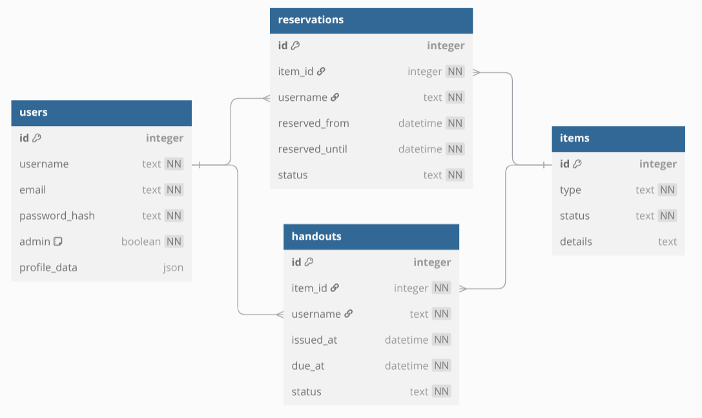

# Datorium patstāvīgais grupu projekts
Patsāvīgi grupā izstrādāt projektu. Projekts tiks vērtēts ar atzīmi.

## Projekta nosacījumi:
> ***Drīkst izmantot jebkuru programmēšanas valodu.***
> 1. Projektā jāimplementē vienkārša autentifikācija *(2 punkti)*
>     1. Lietotāji tiek glābāti datubāzē
>     2. Lietotāju paroles tiek glābātas šifrētā veidā
>     3. Lietotājam ir iespēja reģistrēties un pieslēgties
>     4. Ir vismaz divi dažādi lietotāju veidi ar dažādām tiesībām (admin un parastais)
> 2. Projektā jābūt izmantotām SQL relāciju datubāzēm *(2 punkti)*
>     1. Jābūt vismaz trim ar relāciju (one-to-many, many-to-many) saistītām datu bāzēm.
>     2. Lietotāju datubāze neskaitās
> 3. Izstrādātai programmai jābūt grafiskam lietotāja intefeisam *(2 punkti)*
>     1. Tā var būt Web vai Windows Forms aplikācija, vai jebkurš cits GUI
>     2. Programmas ar tikai konsoles interfeisu netiek ieskaitītas
> 4. Radoša pieeja *(2 punkti)*
>     1. Jebkas, kas piesaistītu vērtētāja uzmanību
>     2. Tā var būt kāda interesanta ideja pašam projektam vai skaists front-end, vai sasaiste ar eksistējošu API
> 5. Noslēguma prezentācija *(2 punkti)*
>     1. Jāsagatavo video prezentācija (vismaz 5min) par projektu
>     2. Prezentācijā jāparāda kā strādā projekts un arī jāpakomentē kods
>     3. Prezentācijai jābūt kvalitatīvai
>     4. Prezentācijā nav obligāti jārunā visiem grupas dalībniekiem, bet uz titullapas jābūt visu dalībnieku vārdiem

Iesniegšanas termiņš: **01.04.2025 23:59**

## Mūsu risinājums

### Ideja
Mūsu skolā ir nepieciešama datoru izsniegšanas sistēma. Datortelpā ir pieejami Windows laptopi, kurus var izmantot jebkurš skolēns, bet šobrīd aktuālas sistēmas viņu izsniegšanai nav. 
Mūsu projekts palīdzētu izveidot risinājumu, kas uzlabotu drošību un pārliecinātos par datoru laicīgu atgriežšanu.

### SQL tabulas
Users
| ID | username   | email                  | password_hash | admin | profile_data                                                 |
|----|------------|------------------------|---------------|-------|--------------------------------------------------------------|
| 1  | vvkocetoks | vvkocetoks@edu.riga.lv | $2a$12$wH9... | 1     | {"name": "Viktors", "surname": "Kočetoks", "class": "12.EI"} |
| 2  | mpunans    | mpunans@edu.riga.lv    | $2a$12$OYn... | 0     | {"name": "Markuss", "surname": "Punāns", "class": "12.EI"}   |
| 3  | esulcs13   | esulcs13@edu.riga.lv   | $2a$12$XbN... | 0     | {"name": "Emīls", "surname": "Šulcs", "class": "12.EI"}      |

Items
| ID | item     | details    |
|----|----------|------------|
| 1  | Computer | Windows OS |
| 2  | Charger  | 9V adapter |
| 3  | Mouse    | USB-A      |

Handouts
| ID | item_id  | username   | issued_at        | due_at           | returned_at      |
|----|----------|------------|------------------|------------------|------------------|
| 1  | 2        | vvkocetoks | 08:37 11.02.2025 | 12:20 11.02.2025 | 12:17 11.02.2025 |
| 2  | 1        | vvkocetoks | 08:37 11.02.2025 | 12:20 11.02.2025 | 12:17 11.02.2025 |
| 3  | 3        | vvkocetoks | 08:37 11.02.2025 | 12:20 11.02.2025 | 12:17 11.02.2025 |

Reservations

| ID | item_id   | username   | reserved_from     | reserved_until   | status    |
|----|-----------|------------|-------------------|------------------|-----------|
| 1  | 1         | esulcs13   | 10:00 12.02.2025  | 12:00 12.02.2025 | active    |
| 2  | 2         | vvkocetoks | 14:00 12.02.2025  | 16:00 12.02.2025 | cancelled |
| 3  | 3         | mpunans    | 09:00 13.02.2025  | 11:00 13.02.2025 | completed |

### Mūsu grupa
Viktors Kočetoks, Markuss Punāns, Emīls Šulcs
12. EI klase, Rīgas Valsts vācu ģimnāzija

### Papildus iespējamās idejas
Microsoft kontu pieslēgšanās - viss vienā platformā
Tumšais un gaišais režīms
Skolas mājaslapā pieejams skaits ar pieejamiem datoriem
